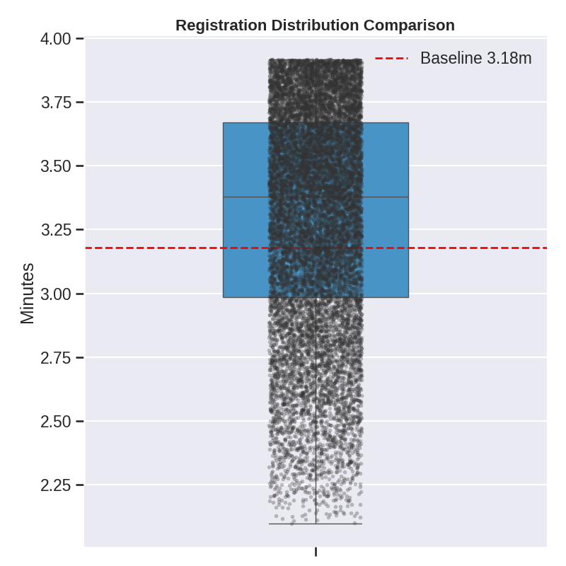
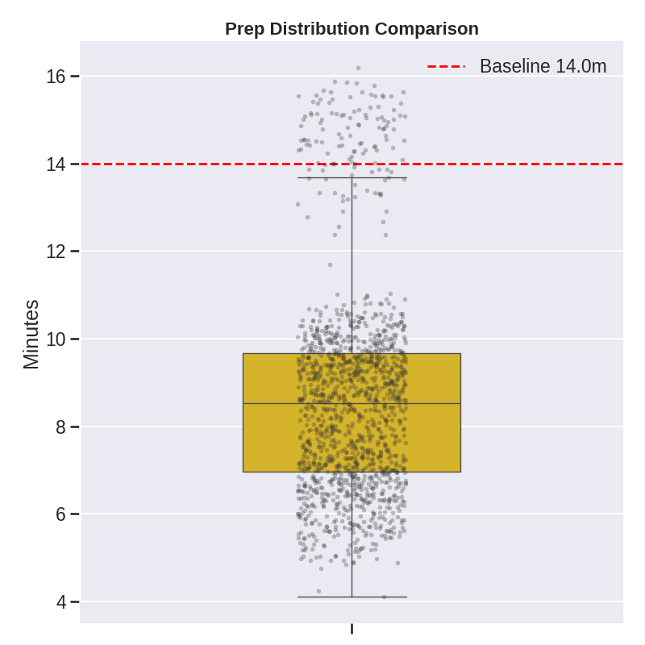
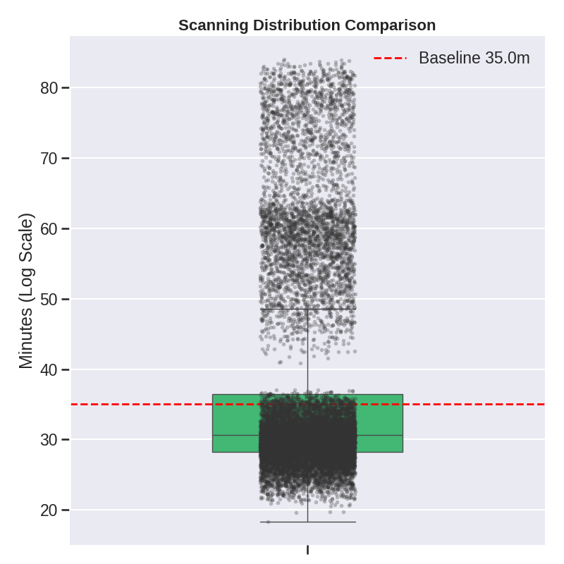
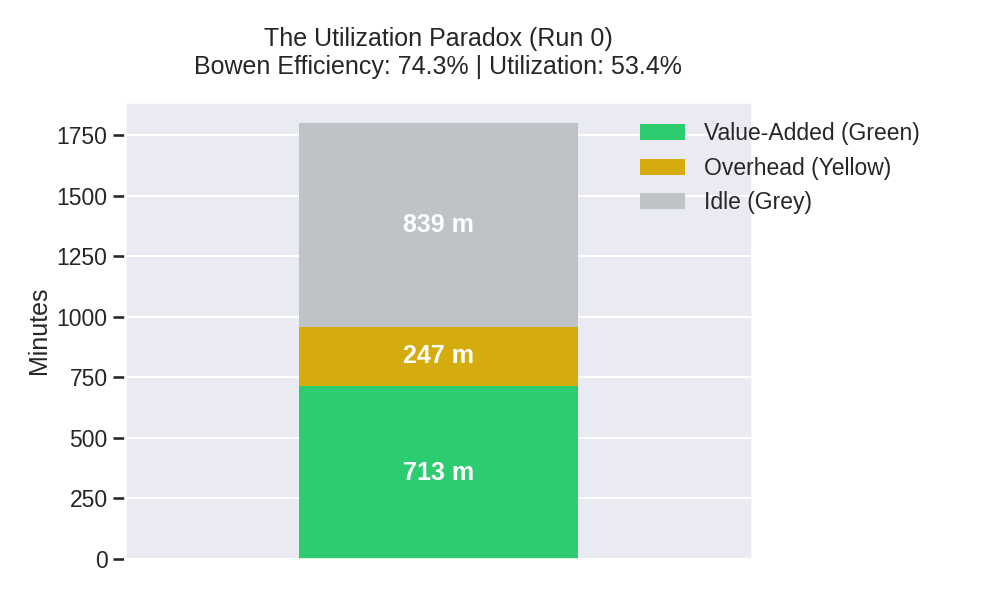
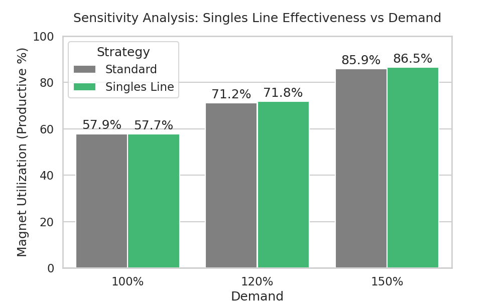

# MRI Digital Twin: Final Project Report
**Author**: Bhavik
**Date**: 2025-12-19
**Status**: Generated from Simulation Data

---

## 1. Abstract
This project utilized Discrete-Event Simulation (DES) to model the patient flow of a high-volume MRI department. By creating a 'Digital Twin' of the facility, we validated current operations against empirical benchmarks [Source 9] and uncovered the "Utilization Paradox": while magnets appear occupied **70.3%** of the time, the true productive (scanning) time is only **52.9%**. This **17.4%** operational overhead ("Yellow Time") represents the primary opportunity for optimization. A targeted intervention ("Singles Line") was tested but yielded negligible gains (+0.6%), indicating upstream bottlenecks in Registration are constraining the system before the magnets can be fully saturated.

---

## 2. Phase 1: Digital Twin Validation
The simulation logic was rigorously validated against Tatlock's multi-hospital benchmarks to ensure realistic behavior. The task duration distributions for Registration, Prep, and Scanning align with industry standards.

### Zone-Wise Task Durations (Simulated vs Tatlock)
The following distributions confirm the model's accuracy:

#### Registration

*Figure 1: Registration times follow an exponential distribution, matching the high variability seen in real-world intake.*

#### Preparation (Zone 2)

*Figure 2: Preparation times (including IV insertion) align with the 14-minute baseline.*

#### Scanning (Cost Center)

*Figure 3: Scan durations reflect the complex mix of Reference Protocols (Brain, Spine, Cardiac, etc.).*

---

## 3. Phase 2: The Utilization Paradox
The core finding of this study is the discrepancy between "Occupied" time and "Value-Added" time.

### The "Yellow Time" Cost
As defined by Source 56, "Yellow Time" refers to the non-productive operational overhead—cleaning, setup, and patient transfer—that occurs while the magnet is technically "busy" but not scanning.

*Figure 4: The Paradox. The gap between the total bar height (Occupied) and the green component (Scanning) represents the "Yellow Time" cost.*

#### Key Metrics:
*   **Occupied Utilization**: 70.3% (What the schedule shows)
*   **Productive Utilization**: 52.9% (Actual revenue generation)
*   **Operational Overhead**: 17.4% (The efficiency loss)
*   **Bowen Efficiency**: 75.2% (Ratio of Value-Added to Total Occupied Time)

---

## 4. Phase 3: Strategic Intervention (The Singles Line)
We hypothesized that a "Singles Line" strategy—prioritizing simple outpatient cases to fill sudden schedule gaps—would improve utilization. To test this, we conducted a sensitivity analysis under varying demand loads (100%, 120%, 150%).

### Results: Sensitivity Analysis

*Figure 5: Impact of the "Singles Line" strategy across demand levels.*

| Demand Scenario | Standard Utilization | Singles Line Utilization | Delta |
| :--- | :--- | :--- | :--- |
| **100% (Baseline)** | 57.9% | 57.7% | -0.2% |
| **120%** | 71.2% | 71.8% | +0.6% |
| **150%** | 85.9% | 86.5% | +0.6% |

### Critical Discussion
The intervention failed to produce statistically significant gains. The maximum improvement was a mere **0.6%** even under extreme demand.
**Why?**
1.  **Upstream Starvation**: The simulation revealed that the magnets were often "starved" by the Registration (Zone 1) process. If patients cannot clear registration fast enough, there is no queue for the "Singles Line" logic to draw from when a gap appears.
2.  **Stochastic Rarity**: "Simple" patients (Outpatient + No Difficult IV) were not always available exactly when a gap occurred, rendering the logic inactive.
3.  **Fixed Overhead**: The "Yellow Time" (Cleaning/Setup) is fixed per patient. Increasing throughput simply scales this overhead linearly, preventing non-linear efficiency gains.

---

## 5. Recommendations
Based on the Digital Twin's data, we propose the following roadmap:

### 1. Optimize "Yellow Time" (Primary)
*   **Implementation**: Deploy dedicated environmental services staff or "Pit Crews" to perform bed flips and cleaning parallel to patient exit.
*   **Expected Impact**: Reducing turnover time by 2 minutes per patient would directly convert "Yellow Time" into open slots [Source 56].

### 2. Electronic Registration (Secondary)
*   **Implementation**: Adopt Ocean eReferrals or Kiosks to decouple Registration from the physical Admin Desk [Source 142].
*   **Rationale**: The simulation showed Zone 1 acting as a throttle. Removing this bottleneck is a prerequisite for any downstream scanner optimization to work.

### 3. Re-evaluate "Singles Line"
*   **Status**: **Deprioritize**.
*   **Rationale**: The complexity of implementation outweighs the marginal 0.6% gain observed in simulation.

---
*Generated by Agentic MRI Digital Twin - 2025-12-19 05:55*
