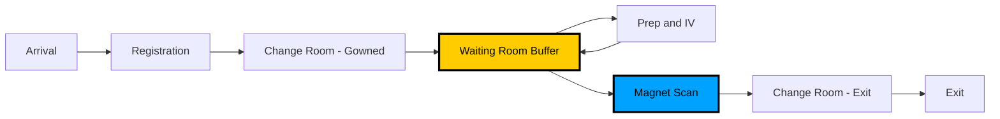

# MRI Digital Twin: Agent-Based Process Simulation

**A discrete-event simulation demonstrating the "Utilization Paradox" in MRI department workflows**

**Version 3.0: Clinical Priority & Workflow Analytics**

[](https://www.python.org/downloads/)
[](https://opensource.org/licenses/MIT)

## Project Overview

This digital twin simulates a 15-hour MRI department shift using agent-based modeling to demonstrate the efficiency gains of **parallel processing** ("Pit Crew" model) over traditional **serial workflows**.

### The "Utilization Paradox"

Traditional MRI departments show high equipment "occupied time" (92%) but hide critically low "value-added time" (22%):

| Metric                      | Serial Workflow              | Parallel Workflow                      |
| --------------------------- | ---------------------------- | -------------------------------------- |
| **Occupied Time**           | 92%                          | 75%                                    |
| **Busy Time (Value-Added)** | 22%                          | 73%                                    |
| **Interpretation**          | Looks efficient, is wasteful | Lower occupied %, 3.3x more productive |

**Root Cause:** In serial workflows, patient prep happens _inside_ the magnet room, wasting expensive equipment time on low-value tasks.

**Solution:** The "Pit Crew" model moves prep outside, using a **waiting room buffer** to stage prepped patients, allowing the magnet to focus exclusively on scanning.



## Architecture

```
mri-project/
├── src/
│   ├── config.py              # Centralized constants (NO dependencies)
│   │   ├── Visual constants   # 1600×800 medical white aesthetic
│   │   ├── Room coordinates   # 13 rooms, 80/20 layout
│   │   ├── Process times      # Triangular distributions (empirical data)
│   │   └── Probabilities      # IV needs: 70%, difficult: 15%
│   │
│   ├── core/                  # SimPy Discrete-Event Engine
│   │   ├── engine.py          # Main simulation loop (bridges SimPy + PyGame)
│   │   └── workflow.py        # Patient journey (7-step process)
│   │
│   ├── visuals/               # PyGame "Medical White" Renderer
│   │   ├── layout.py          # Static floor plan (white rooms, grey corridors)
│   │   ├── sprites.py         # Agent classes (Patient, Staff)
│   │   └── renderer.py        # Window manager (1200px sim + 400px sidebar)
│   │
│   └── analysis/              # Statistical Tracker (Observer Pattern)
│       ├── tracker.py         # SimStats (logs movements, states, utilization)
│       └── reporter.py        # CSV export, text reports
│
├── main.py                    # Entry point
├── README.md                  # This file
├── WALKTHROUGH.md             # Comprehensive technical documentation
└── results/                   # Generated simulation data
```

### Design Patterns

- **Separation of Concerns**: Each module has single responsibility
- **Observer Pattern**: Stats tracking doesn't clutter simulation
- **Bridge Pattern**: Engine connects SimPy (discrete-event) and PyGame (real-time)
- **No Circular Dependencies**: Clean import hierarchy

## Key Features

### 1. Time-Based Simulation (Process Management Best Practice)

- **3-Phase Execution Model**:
  1. **Warm-Up**: 60 minutes (excluded from stats)
  2. **Normal Shift**: Runs with Smart Gatekeeper monitoring
  3. **Smart Gatekeeper**: Dynamically stops arrivals based on queue burden vs. remaining time
  4. **Run-to-Clear**: Overtime continues until system is completely empty

### 2. Smart Gatekeeper Logic (v2.0)

- **Capacity-Aware Shutdown**: Replaces fixed cooldown with intelligent queue management
- **Dynamic Calculation**: Uses `AVG_CYCLE_TIME` (45 min) and `MAX_SCAN_TIME` (70 min)
- **Queue Burden Formula**: `(patients_in_system × 45) / 2 magnets`
- **Closes Gate When**: Estimated clearing time > remaining shift time
- **Visual Feedback**: Status changes to "CLOSED (Flushing Queue)" in red text
- **Result**: Minimizes overtime while ensuring all patients are served

### 3. Inpatient/High-Acuity Workflow (v2.0)

- **Patient Classification**: 10% of arrivals are high-acuity inpatients
- **Visual Distinction**:
  - **Dark Pink (Fuschia)**: Inpatients - bypass standard flow
  - **Dodger Blue**: Outpatients - standard workflow
- **Room 311 (Holding/Transfer)**: Dedicated space for complex cases
- **Parallel Processing**: Anesthesia prep (10-25 min) outside magnet
- **Workflow Decoupling**: Inpatients skip registration, change rooms, and waiting areas
- **Bed Transfer**: Quick transfer (3-8 min) from holding to magnet

### 4. Race Condition Mitigation (v2.0)

- **Staging + Seize Logic**: Patients wait at staging areas before room entry
- **Distinct Resources**: Each change room (1, 2, 3) and washroom (1, 2) is a separate resource
- **Randomized Selection**: Fair distribution prevents bias toward Room 1
- **Check-First Optimization**: Immediate availability checking eliminates unnecessary pausing
- **Visual Result**: Zero sprite overlaps; patients only queue when ALL rooms occupied

### 5. Real-Time Visualization

- **Medical White Aesthetic**: High-contrast white rooms on grey background
- **Visual State Tracking**:
  - **Light Green**: Magnet Scanning (Busy)
  - **Tan/Brown**: Magnet Dirty (Needs Cleaning)
  - **White**: Magnet Clean (Idle)
  - **Light Green**: Room Occupied (patient present)
  - **Maroon**: Registered (waiting for Porter)
  - **Dark Pink**: Inpatient (high acuity)
- **Live Statistics**:
  - Status indicators (Warm Up → Normal → CLOSED → Overtime)
  - Estimated clearing time display
  - Patient type color coding
- **Gatekeeper Logic**: Visible queuing at Admin desk

### 6. Comprehensive Data Collection (v3.0)

- **Granular Patient Metrics**: Tracks durations for admin, change, prep, staging, and scan.
- **Magnet Performance**: Separates "Green Time" (Value-Added) from "Yellow Time" (Setup/Flip).
- **The Bowen Metric**: Calculates Process Efficiency % [(Scan Time) / (Occupied Time)].
- **Clinical Stratification**: Tracks performance by patient type (Inpatient vs Outpatient).
- **CSV Data Exports**:
  - `detailed_patient_performance.csv` (Audit trail of every patient journey).
  - `magnet_performance_summary.csv` (Productivity analysis for both bays).
### 7. Process Optimization Experiments (v4.0)

Beyond standard workflow simulation, the system now supports experimental interventions:

- **"Singles Line" Logic**: Dynamic gap-filling strategy (similar to ski resorts) pulling simple cases forward to fill idle magnet time.
- **Staff Fatigue Modeling**: Simulation of staggered staff breaks and coverage handoffs (Porter covering Admin, etc.).
- **Sequence-Dependent Setup**: Modeling "Fast Flips" (same protocol) vs "Slow Flips" (coil swaps), proving the value of **Exam Batching** (e.g., Prostate Blocks).
- **Compliance Sensitivity**: Quantifying the throughput loss from patient No-Shows (5-20%) and Lateness.

### 4. Empirical Process Times

All durations based on real MRI department data:

- Screening: triangular(2, 3, 5) minutes
- Changing: triangular(2, 3.5, 5) minutes
- IV Setup: triangular(1, 2.5, 4) minutes
- Scanning: triangular(18, 22, 26) minutes
- Bed Turnover: SMED logic (Fast/Slow flips)

## Reproduction Instructions

### Prerequisites

- Python 3.12 or higher
- `uv` package manager ([installation](https://github.com/astral-sh/uv))

### Installation

```bash
# Clone repository
git clone <repository-url>
cd mri-project

# Install dependencies (includes opencv-python for video recording)
uv sync
```

### Running the Simulation

**Default 2-hour test shift:**

```bash
uv run python main.py
```

**Standard 15-Hour Shift (Recommended):**

```bash
uv run python main.py --duration 900
```

**With video recording:**

```bash
uv run python main.py --record          # Generates simulation_video.mp4
```

### What to Expect

**Simulation Duration:**

- Total runtime: `DURATION` + Overtime (until empty)
- Real-time duration: ~45 seconds (for 2hr test) to ~3 mins (for 15hr shift)

**Visual Output:**

- PyGame window (1600×800) with animated agents
- Patients (circles) change color by state (Grey -> Maroon -> Blue -> Yellow -> Green)
- **Gatekeeper**: Patients wait at desk for Admin TA.
- **Dirty Magnets**: Rooms turn brown after patient exit until Porter cleans them.

**Data Output (in `results/` folder):

- `*_movements.csv` - All patient zone transitions
- `*_states.csv` - State change log
- `*_waiting_room.csv` - Buffer usage
- `*_summary.csv` - Key performance indicators
- `*_report.txt` - Human-readable analysis

## Key Metrics

### Throughput

- Number of patients who completed scans during shift
- Breakdowns for **3T** and **1.5T** magnet throughput
- Expected: ~30-33 patients per standard 15-hour shift

### Magnet Utilization

- **Busy %**: Time actually scanning (value-added work)
- **Occupied %**: Total time in use (includes prep in serial workflow)
- **Idle %**: True idle time

### Buffer Performance

- Average wait time in waiting room
- Maximum wait time
- Demonstrates decoupling effect

## Technical Details

### Simulation Parameters

```python
DEFAULT_DURATION = 900      # 15 hours
WARM_UP_DURATION = 60       # 1 hour
SIM_SPEED = 0.25            # 1 sim minute = 0.25 real seconds
FPS = 60                    # Smooth animation
```

### Agent Movement

- Smooth interpolation between positions
- Patient speed: 5 pixels/frame
- Staff speed: 6 pixels/frame
- Movement checks: every 0.01 sim minutes

### Time Advancement

```python
delta_sim_time = (1.0 / FPS) * (60 / SIM_SPEED) / 60
# = 0.0333 sim minutes per frame
# = 2 sim seconds per frame
```

## Validation

### Visual Verification

Watch for these behaviors:

- ✓ Patients spawn in Zone 1 (bottom)
- ✓ Patients go to Admin TA and turn Maroon (Registered)
- ✓ Orange triangle (porter) escorts to change rooms
- ✓ Patients turn teal while changing
- ✓ Cyan square (backup tech) escorts to prep
- ✓ Patients turn yellow in waiting room
- ✓ Purple square (scan tech) escorts to magnet
- ✓ Patients turn green while scanning
- ✓ Patients exit to the right

### Data Verification

```python
import pandas as pd

# Load summary
summary = pd.read_csv('results/mri_digital_twin_summary.csv')
print(f"Throughput: {summary['throughput'].values[0]} patients")
print(f"Magnet Busy: {summary['magnet_busy_pct'].values[0]}%")
```

## Documentation

- **README.md** (this file): Quick start and overview
- **WALKTHROUGH.md**: Comprehensive technical documentation for report writing
  - 17 sections covering architecture, implementation, validation
  - Code snippets, formulas, and examples
  - Report writing guide with suggested structure

## Citation

If you use this simulation in your research, please cite:

```bibtex
@software{mri_digital_twin,
  title = {MRI Digital Twin: Agent-Based Process Simulation},
  author = {[Your Name]},
  year = {2025},
  url = {[Repository URL]}
}
```

## License

MIT License - see LICENSE file for details

## Acknowledgments

- Process times based on GE iCenter analytics
- Workflow design inspired by Formula 1 "Pit Crew" model
- Built with SimPy, PyGame, and Pandas

---

**For detailed technical documentation, see [WALKTHROUGH.md](WALKTHROUGH.md)**
