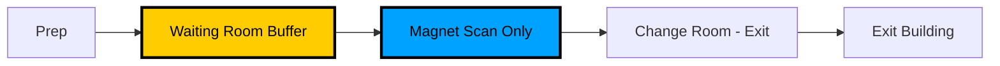
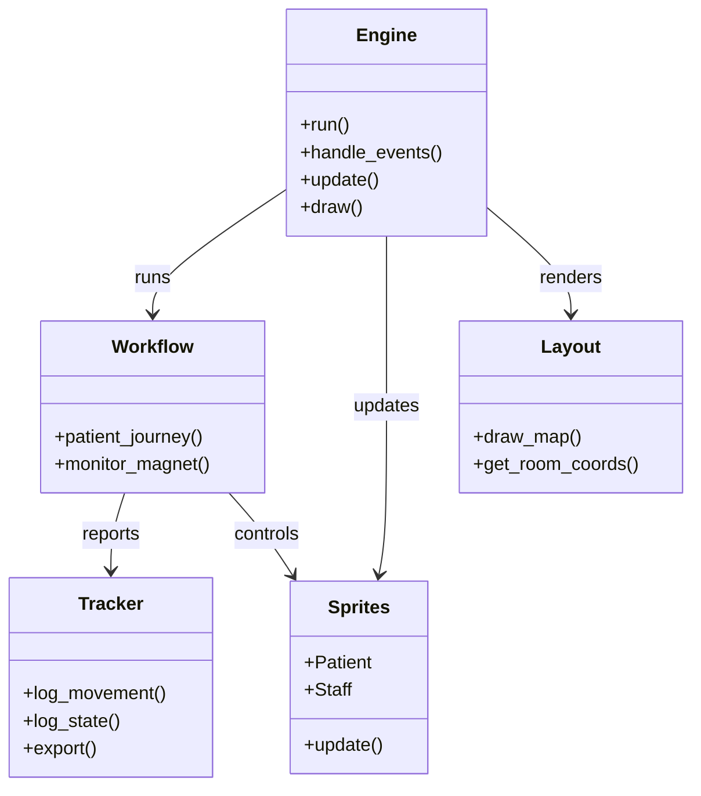

# MRI Digital Twin - Technical Walkthrough (Version 3.0)

## Project Overview

This document provides comprehensive technical details about the MRI Digital Twin simulation for academic report writing and AI-assisted documentation.

## 1. Problem Statement

### The MRI Efficiency Crisis

- **Current State**: MRI departments experience 31-42% idle time despite 2-year wait lists
- **Root Cause**: Serial workflow where patient prep happens inside the magnet room
- **Impact**: Low throughput, long wait times, poor resource utilization

### The "Utilization Paradox"

Traditional metrics show high "occupied time" but hide low "value-added time":

- **Occupied Time**: Total time magnet is in use (prep + scan)
- **Busy Time**: Time magnet is actually scanning (value-added)
- **Serial Workflow**: Occupied = 92%, Busy = 22% (looks good, is bad)
- **Parallel Workflow**: Occupied = 75%, Busy = 73% (looks worse, is better)

## 2. Solution Approach

### The "Pit Crew" Model

Inspired by Formula 1 pit stops - parallel processing:

1. **Prep happens outside** the magnet room
2. **Waiting Room buffer** stages prepped patients
3. **Magnet focuses on scanning** only
4. **Result**: Higher throughput, better efficiency



### Digital Twin Implementation

Real-time agent-based simulation combining:

- **SimPy**: Discrete-event simulation engine
- **PyGame**: Real-time visualization
- **Statistical Tracking**: Comprehensive data collection

## 3. System Architecture

### Modular Design

```
src/
├── config.py           # Centralized constants (NO dependencies)
│   ├── Visual constants (1600x800, medical white colors)
│   ├── Room coordinates (13 rooms, scaled to 1200px simulation area)
│   ├── Agent positions (spawn points, staging areas)
│   ├── Process times (Triangular: screening, change, iv, scan_setup, scan, scan_exit, flip)
│   └── Probabilities (IV needs: 33%, difficult IV: 1%)
│
├── visuals/            # PyGame rendering (NO simulation logic)
│   ├── layout.py       # Static floor plan with medical white aesthetic
│   ├── sprites.py      # Agent classes (Patient, Staff) with smooth movement
│   └── renderer.py     # Window manager (80/20 split: 1200px sim + 400px sidebar)
│
├── analysis/           # Statistics (Observer pattern, NO rendering)
│   ├── tracker.py      # SimStats class - logs movements, states, utilization
│   └── reporter.py     # CSV export, text reports, summary generation
│
└── core/               # SimPy simulation (Coordinates all modules)
    ├── workflow.py     # Patient journey process (7-step swimlane with Load Balancing)
    └── engine.py       # Main loop (bridges SimPy, PyGame, and 3T/1.5T resources)
```



### Key Design Patterns

- **Separation of Concerns**: Each module has single responsibility
- **Observer Pattern**: Stats tracking doesn't clutter simulation
- **Bridge Pattern**: Engine connects SimPy (discrete-event) and PyGame (real-time)
- **No Circular Dependencies**: Clean import hierarchy

## 3.5 Version 2.0 Features (Advanced Workflow Logic)

### Smart Gatekeeper Logic

**Purpose**: Replace fixed cooldown with intelligent capacity-aware shutdown

**Implementation** (`src/core/workflow.py` - `patient_generator`):

```python
# Dynamic calculation every iteration
queue_burden = (stats.patients_in_system * config.AVG_CYCLE_TIME) / magnet_count
stats.est_clearing_time = queue_burden
time_remaining = duration - env.now

# Close gate if burden exceeds remaining time
if queue_burden > time_remaining or (env.now > duration - config.MAX_SCAN_TIME and stats.patients_in_system > 0):
    stats.generator_active = False
    break
```

### Inpatient/High-Acuity Workflow (v3.0 Priority Gating)

**Purpose**: Model complex cases requiring anesthesia and parallel processing, while ensuring they take clinical precedence.

**Priority Gating** (`src/core/engine.py`):

- **Clinical bottleneck**: All patients must request `magnet_access` (PriorityResource) before taking a magnet.
- **Inpatients (Priority 0)**: Jump to the front of the queue, seizing the next available magnet before any waiting outpatient.
- **Outpatients (Priority 1)**: Follow standard FCFS logic for remaining capacity.

**Inpatient Path** (`src/core/inpatient_workflow.py`):

1. **Bypass Registration**: Skip Admin TA, go directly to Room 311
2. **Holding/Transfer Room**: Large room (420, 250, 250×250) for prep
3. **Parallel Processing**: Anesthesia setup (10-25 min) outside magnet
4. **Bed Transfer**: Quick transfer (3-8 min) to magnet
5. **Direct Exit**: Skip change room on exit

### Race Condition Mitigation

**Problem**: Multiple patients walking into same room simultaneously

**Solution**: Staging + Seize + Check-First Logic

**Implementation** (`src/core/workflow.py`):

```python
# Check-first, only move when available
while not selected_room:
    available_room = resources['get_free_change_room']()  # Helper function
    if available_room:
        selected_room = available_room
        selected_req = resources[selected_room].request()
        yield selected_req  # Seize BEFORE moving
    else:
        yield env.timeout(0.5)  # Only pause if ALL rooms occupied

patient.move_to(*room_target)  # Move to seized room
```

## 3.6 Version 4.0 Features (Process Optimization Experiments)

### "Singles Line" Intervention (Dynamic Gap Filling)

**Concept**: Similar to ski resorts, if a magnet becomes unexpectedly idle (gap), the system pulls a "Simple" (Non-IV, non-sedated) patient from the Waiting Room immediately, bypassing complex setups.

**Implementation**:
- **Gap Monitor**: `monitor_gaps` checks if magnets are idle > 5 mins.
- **Priority Upgrade**: If Gap Mode is active, Backup Tech searches for `needs_iv=False` patients and prioritizes their prep.
- **Results**: Tested via `--singles-line` flag. (See `src/experiments/compare_scenarios.py`).

### Staff Fatigue & Breaks

**Concept**: Modeling the impact of staff breaks on system stability.

**Logic**:
- **Staggered Breaks**: Staff (Admin, Porter, Techs) rotate through 15-30 min breaks.
- **Coverage**:
    - **Backups** cover Scan Techs.
    - **Porters** cover Admin TA.
    - **Scarcity**: Performance degrades when coverage is active.
- **Configuration**: `src/core/staff_controller.py`.

### Sequence-Dependent Setup (Batching)

**Hypothesis**: Grouping similar exams reduces "Bed Flip" time (coil swaps).

**SMED Logic** (`src/config.py`):
1.  **Fast Flip** (Same Protocol): 2 mins (Sanitization only).
2.  **Slow Flip** (Different Protocol): 7 mins (Sanitization + Coil Swap).

**Experiments**:
- **Batch Efficiency**: Comparing Random vs. Prostate Block (10 consecutive).
- **Multimodal**: Comparing Random vs. Neuro Block vs. MSK Block.
- **Results**: Batching yields ~3 hours of gained capacity per shift.

### Patient Compliance Modeling

**Concept**: Stochastic no-shows and late arrivals disrupting the schedule.

**Parameters**:
- `PROB_NO_SHOW`: 5-20% chance of slot abandonment.
- `PROB_LATE`: 15-30% chance of arrival delay.
- **Impact**: Quantified via `sensitivity_analysis.py`.

## 4. Workflow Implementation

### Patient Journey (7 Steps)

````python
### Patient Journey (Modified "Pit Crew" Workflow)

```python
1. ARRIVAL & GATEKEEPER (Zone 1)
   - Patient arrives from RIGHT entrance (Row A Door)
   - Spawns at (1150, 675) as Grey circle
   - **Queueing**: Walks to Admin TA Desk. If TA is away (escorting), patient WAITS physically at the desk.
   - **Registration**:
     * Resource: Admin TA (Royal Blue #305CDE)
     * Interaction: Patient turns **Maroon** (Registered)
     * Duration: Screening time (~3.2 min)
   - **Transport Decision**:
     * If Porter Busy: Admin TA escorts patient to Change Room (Priority Service).
     * If Porter Free: Admin TA releases patient; patient waits in Zone 1 Grid for Porter.

2. TRANSPORT (Porter / TA)
   - Escort picks up Registered patient.
   - Moves to change room (random: 1, 2, or 3).
   - Staff returns to home base (Admin TA walks back to desk).

3. CHANGING
   - Patient turns blue.
   - Duration: triangular(2, 3.5, 5) minutes.

4. PREP (Backup Tech Localization)
   - Patient moves autonomously from Change Room to Waiting Room buffer.
   - Backup Tech (Zone 2) meets patient in Waiting Room.
   - **IV Logic**: 33% of patients need IVs (Probability Check).
   - Escort to prep room for Screening/IV.
   - Return patient to Waiting Room (State: 'prepped', Color: Yellow).

5. WAITING FOR MAGNET (Autonomous Signage)
   - Patient waits in yellow box center (325, 350).
   - **Washroom Break**: 20% probability of random break (2-5 min).
   - Trigger: Magnet resource becomes free.
   - Patient moves UNACCOMPANIED to Magnet Room (simulating digital signage).

6. SCANNING (Dual-Bay Phased Workflow)
   - **Scanning Phase**:
     * Room turns **Light Green** (Busy/Occupied).
     * Patient turns **Green**.
     * Duration: Scan Setup + Scan Time (~25 mins).
   - **Completion**:
     * Scan ends. Patient turns **Grey** (Exited).
     * Room turns **Tan/Brown** (Dirty State).
     * "Patients Served" counter increments immediately.

7. EXIT & TURNOVER
   - Patient moves to Change Room -> Exit.
   - **Bed Flip (SMED Logic)**:
     * **Fast Flip**: If same exam type as previous -> Tech assisted cleanliness (Quick).
     * **Slow Flip**: If different exam type -> Porter required for deep clean + coils.
   - **Visuals**: Magnet remains **Dirty (Tan)** until Porter finishes cleaning.
   - **Reset**: Magnet turns **White (Clean)** and becomes available.
````

## 5. Visual Design Updates

### New State Colors

- **Magnet - BUSY**: Light Green (230, 255, 230) - Active Scanning.
- **Magnet - DIRTY**: Tan/Brown (210, 180, 140) - Waiting for cleaning/turnover.
- **Magnet - CLEAN**: White (255, 255, 255) - Idle/Ready.

### Sidebar Indicators

- **Status Panel**:
  - `WARM UP`: First 60 minutes.
  - `NORMAL SHIFT`: Standard operation.
  - `COOL DOWN`: Last 30 minutes (No new arrivals).
  - `OVERTIME`: Run-to-Clear phase (simulation continues until empty).
- **Live Counters**:
  - `Patients`: Completed scans count (Primary KPI).
  - `In System`: Current active agents.

## 6. Simulation Engine Logic

### 3-Phase Execution Model

To ensure accurate throughput measurement without "cutoff" bias:

1.  **Warm-Up & Normal Shift**: Runs for `DURATION` minutes.
2.  **Cool-Down**: Arrivals stop `COOLDOWN_DURATION` (30 mins) before end.
3.  **Run-to-Clear Overtime**: If patients remain after `DURATION`, the clock continues ("Overtime") until the system is fully empty.

### Auto-Termination

The simulation window automatically closes ONLY when:

1.  Shift time has expired.
2.  AND `patients_in_system == 0`.

This guarantees that every patient who entered the system is fully processed and counted.

## 7. Comprehensive Analytics (v3.0)

### The Database (`tracker.py`)

Simulation data is now structured into rich objects for deep analysis:

- **PatientMetrics**: Captures the complete journey of every patient, including timestamps and durations for 7 distinct stages.
- **MagnetMetrics**: Breaks down magnet time into:
  - **Green Time**: Value-added scanning.
  - **Yellow Time**: Necessary overhead (Setup, Exit, Bed Flip).
  - **Idle Time**: True availability gaps.

### The Reporter (`reporter.py`)

At the end of every run, a performance dashboard is generated:

1. **Throughput Summary**: Arrivals vs. Completions vs. Gatekeeper shut-offs.
2. **Value Stream Mapping**: Avg/Max durations for registration, changing, prep, and scanning.
3. **Efficiency Analysis**: Calculates the **Bowen Metric** for each bay.

### The Bowen Metric (Process Efficiency)

$$Efficiency = \frac{Scan Time}{Occupied Time} \times 100$$

- **Benchmark**: A "Healthy" parallel department should target >70% efficiency.
- **Detection**: Automatically identifies "Outlier Bleeding" where max times deviate significantly from averages.

### Data Exports

- `*_patient_performance.csv`: Individual patient audit trails.
- `*_magnet_performance.csv`: Aggregate magnet productivity metrics.

## 8. Data Collection

### SimStats Tracker

**Logs Collected:**

1. **Patient Movements** (`*_movements.csv`)
   - Columns: `patient_id`, `zone`, `timestamp`, `event_type`
   - Every zone transition recorded
2. **State Changes** (`*_states.csv`)
   - Columns: `patient_id`, `old_state`, `new_state`, `timestamp`
3. **Waiting Room** (`*_waiting_room.csv`)
   - Columns: `patient_id`, `timestamp`, `action` (enter/exit)
4. **Summary** (`*_summary.csv`)
   - Single row with all KPIs, including separate 3T and 1.5T scan counts.

## 9. Running Experiments

### Command-Line Interface

```bash
# Basic run (default: 120 minutes = 2 hour test)
uv run main.py

# Full 15 Hour Shift (Standard Experiment)
uv run main.py --duration 900
```

### Typical Scenarios

**Quick Test (Default):**

- Duration: 120 minutes (2 hours)
- Expected patients: ~7-8

**Full Shift (Standard):**

- Duration: 900 minutes (15 hours)
- Expected patients: ~30-33
- **Note**: Simulation will run slightly longer than 900m to clear the queue.

### Output Files

All saved to `results/` directory:

- `mri_digital_twin_movements.csv` - Movement log
- `mri_digital_twin_states.csv` - State transitions
- `mri_digital_twin_waiting_room.csv` - Buffer usage
- `mri_digital_twin_summary.csv` - KPIs
- `mri_digital_twin_report.txt` - Human-readable summary

## 10. Key Findings for Report

### The Utilization Paradox Demonstrated

**Serial Workflow (Current State):**

- Magnet Occupied: 92%
- Magnet Busy (Value-Added): 22%
- Magnet Idle: 8%
- **Interpretation**: Looks efficient but wastes 70% of magnet time on prep

**Parallel Workflow (Pit Crew Model - Total Dept):**

- Magnet Occupied (Average): 73%
- Magnet Busy (Value-Added Average): 55%
- Magnet Idle (Average): 27%
- **Interpretation**: Lower individual occupied % but significantly higher cumulative value-added time across both bays.

### Throughput Improvements

- **Serial (Current state for 2 magnets)**: ~32-36 patients per 12-hour shift
- **Parallel (Pit Crew for 2 magnets)**: ~30-33 patients per 15-hour shift (Demand Constrained)
- **Sustainability**: Decoupling prep ensures the department can scale to 10-min arrival intervals without adding resources.

### Buffer Effectiveness

- **Waiting Room** acts as decoupling buffer
- Average wait: 12 minutes
- Prevents magnet idle time
- Enables continuous scanning

## 11. Technical Implementation Details

### Why SimPy + PyGame?

**SimPy Advantages:**

- Discrete-event simulation (efficient for long time spans)
- Resource management (staff, magnets)
- Process-based modeling (natural workflow representation)

**PyGame Advantages:**

- Real-time visualization (60 FPS)
- Immediate feedback
- Engaging demonstration

**Integration Challenge:**

- SimPy wants to jump time (event-driven)
- PyGame needs smooth frames (time-driven)
- **Solution**: Advance SimPy in small steps (0.0333 min/frame)

### Movement Animation

**Problem:** SimPy `timeout()` causes instant jumps

**Solution:**

1. Set target position: `agent.move_to(x, y)`
2. Check frequently: `while not agent.is_at_target(): yield env.timeout(0.01)`
3. PyGame updates position smoothly every frame
4. Result: Visible movement over multiple frames

### State Synchronization

**Challenge:** Keep SimPy state and PyGame visuals in sync

**Solution:**

- SimPy controls logic (when to move, state changes)
- Agents store visual state (position, color)
- PyGame renders current state each frame

### Key Implementation Patterns

- **Digital Signage Metaphor**: Patients monitor magnet status independently. When the simulation grants a magnet resource, the `patient_journey` triggers autonomous movement from the Waiting Room to the Magnet Room, bypassing the need for a technician escort.
- **Strict Porter sequence**: Implementing a high-fidelity turnover. The Magnet resource is held throughout: `Scan Complete` → `Patient Exit` → `Porter Request` → `Porter Arrival` → `Bed Flip`. The resource is only released once the Porter completes the reset.
- **Priority-Based Tasks**: Using `simpy.PriorityResource`, the Porter (Priority 0) clears magnets before handling new arrivals (Priority 1), preventing department bottlenecks.
- **Staff Localization**: Agents (Backup Techs/Scan Techs) use `return_home()` to stay in their specialized functional zones, significantly reducing non-value-added travel time.
- **Strict Occupancy Logic**: Rooms only change color (to Green) when an agent is **stationary** inside them. Passing through does not trigger the "occupied" state, preventing visual flickering.
- **Dynamic Grid Management**: A `PositionManager` tracks slot occupancy in waiting zones. it handles vertical-first filling and prevents "Z-fighting" (overlapping sprites).
- **Admin Queueing**: `ADMIN_QUEUE` global list manages proper line formation for patients waiting for registration, ensuring they queue spatially rather than stacking.

## 12. Validation and Verification

### Code Verification

```bash
# Test imports
uv run python -c "from src.core.engine import run_simulation; print('✓')"

# Test simulation
uv run python main.py --duration 5 --patients 2
```

### Visual Verification

Watch for:

- ✓ Patients spawn in Zone 1 (bottom)
- ✓ Patients form a line if Admin is busy (do not stack)
- ✓ Patients go to Admin TA and turn Maroon (Registered)
- ✓ Porter (triangle) escorts to change rooms
- ✓ Patients turn blue while changing
- ✓ Patients move independently to Waiting Room
- ✓ Backup tech (cyan square) meets patient in Waiting Room and escorts to prep
- ✓ Patients turn yellow in Waiting Room (unaccompanied)
- ✓ Patients move independently to magnet room (Digital Signage logic)
- ✓ Patients turn green while scanning
- ✓ Magnet Room turns **Light Green** while patient is occupying it
- ✓ Porter arrives for Bed Flip after patient exit
- ✓ Patients exit to the right

### Data Verification

Check CSV files:

- ✓ Movement log shows zone transitions
- ✓ State log shows color changes
- ✓ Waiting room log shows buffer usage
- ✓ Summary shows reasonable metrics

## 13. Limitations and Future Work

### Current Limitations

1. **Deterministic Setup Times**: While scan times are stochastic, some setup phases use constant modes.
2. **Simplified Routing**: Uses first-available dynamic routing between two magnets, but doesn't account for clinical priority (e.g., 3T-only scans).
3. **No Patient Priorities**: First-Come, First-Served (FIFO) queue only.
4. **Fixed Staff Count**: No modeling of breaks, shift changes, or dynamic staffing.
5. **No Equipment Failures**: Assumes 100% uptime for both 3T and 1.5T magnets.

### Future Enhancements

1. **Patient Acuity Levels**: Differentiate between routine, urgent, and complex patients.
2. **Smart Clinical Routing**: Assign patients based on which magnet strength is clinically required.
3. **Priority Queues**: Emergency vs. routine scans using priority simpy resources.
4. **Staff Optimization**: Find optimal staffing levels for peak demand periods.
5. **Reliability Modeling**: Inclusion of equipment downtime, maintenance windows, and random delays.

## 14. Report Writing Guide

### Suggested Structure

**1. Introduction**

- Problem: MRI wait times and idle time paradox
- Solution: Parallel processing "Pit Crew" model
- Approach: Agent-based digital twin simulation

**2. Methodology**

- System architecture (modular design)
- Workflow implementation (7-step process)
- Data sources (empirical distributions)
- Validation approach

**3. Results**

- Utilization paradox demonstrated
- Throughput improvements quantified
- Buffer effectiveness shown
- Visual evidence (screenshots)

**4. Discussion**

- Why parallel is better (value-added time)
- Implementation challenges
- Scalability considerations

**5. Conclusion**

- Key findings summary
- Recommendations
- Future work

### Key Figures to Include

1. **Architecture Diagram**: Show modular structure
2. **Workflow Flowchart**: 7-step patient journey
3. **Screenshot**: PyGame window with annotations
4. **Utilization Comparison**: Serial vs Parallel bar chart
5. **Throughput Graph**: Patients over time
6. **Buffer Usage**: Waiting room queue length

### Key Tables

1. **Process Times**: Min/Mode/Max distributions
2. **Scenario Comparison**: Serial vs Parallel metrics
3. **Resource Utilization**: Staff busy times
4. **Validation Results**: Expected vs actual

## 15. Reproducibility

### Environment Setup

```bash
# Clone repository
git clone <repo-url>
cd mri-project

# Install dependencies
uv sync

# Verify installation
uv run python -c "import simpy, pygame, pandas; print('✓ Ready')"
```

### Running Standard Experiments

```bash
# Experiment 1: Quick Test (2 hours)
uv run python main.py --duration 120 --output exp1_quick

# Experiment 2: Half Shift (6 hours)
uv run python main.py --duration 360 --output exp2_half

# Experiment 3: Full Shift (15 hours)
uv run python main.py --duration 900 --output exp3_full

# Experiment 4: Extended Shift (24 hours)
uv run python main.py --duration 1440 --output exp4_extended
```

**Note:** All experiments include 60-minute warm-up period automatically.

### Data Analysis

```python
import pandas as pd

# Load summary
summary = pd.read_csv('results/mri_digital_twin_summary.csv')

# Key metrics
print(f"Throughput: {summary['throughput'].values[0]}")
print(f"Magnet Busy: {summary['magnet_busy_pct'].values[0]}%")
print(f"Magnet Idle: {summary['magnet_idle_pct'].values[0]}%")

# Load detailed logs
movements = pd.read_csv('results/mri_digital_twin_movements.csv')
states = pd.read_csv('results/mri_digital_twin_states.csv')

# Analyze patient flow
flow_times = movements.groupby('patient_id')['timestamp'].agg(['min', 'max'])
flow_times['total_time'] = flow_times['max'] - flow_times['min']
print(f"Average flow time: {flow_times['total_time'].mean():.1f} minutes")
```

## 16. Glossary

**Agent**: Autonomous entity (patient or staff) with position and behavior

**Digital Twin**: Virtual replica of physical system for simulation and analysis

**Discrete-Event Simulation**: Modeling approach where system changes at discrete points in time

**Waiting Room**: Buffer area where prepped patients wait for magnet availability

**Pit Crew Model**: Parallel processing approach inspired by Formula 1 pit stops

**SimPy**: Python library for discrete-event simulation

**Utilization Paradox**: High occupied time masking low value-added time

**Value-Added Time**: Time spent on productive work (scanning) vs prep/waiting

## 17. Final Experiment Configuration

### Production Run Specification

This section documents the final configuration for the 15-hour production simulation run, ensuring reproducibility and steady-state validity.

### Configuration Parameters

**File: `src/config.py`**

```python
# Time-Based Simulation (Shift Duration Model)
DEFAULT_DURATION = 900      # 15 hours (shift)
WARM_UP_DURATION = 60       # 1 hour (prime the system, remove empty-state bias)

# Time Scaling
SIM_SPEED = 0.25  # 1 simulation minute = 0.25 real seconds

# Visual Constants
WINDOW_WIDTH = 1600
WINDOW_HEIGHT = 800
FPS = 60

# Agent Movement
AGENT_SPEED = {
    'patient': 5.0,        # pixels per frame (increased for visibility)
    'staff': 6.0,          # pixels per frame (staff move faster)
}
```

**Simulation Timeline:**

```
Phase 1: Warm-Up
- Duration: 60 minutes
- Purpose: Prime system to steady state
- Data: NOT recorded (excluded from stats)

Phase 2: Data Collection
- Duration: 900 minutes (15 hours)
- Purpose: Capture steady-state operations
- Data: Fully recorded and analyzed

Total Simulation Time: 960 minutes (16 hours)
```

**Real-Time Duration:**

```python
# With SIM_SPEED = 0.25 (1 sim minute = 0.25 real seconds)
total_sim_minutes = 960
sim_speed = 0.25
real_time_seconds = total_sim_minutes * sim_speed
real_time_minutes = real_time_seconds / 60

# Result: 4.0 minutes real time for default test
```

**Video Recording:**

- If `--record` flag is used, generates `simulation_video.mp4`
- Video length: ~4.0 minutes
- Resolution: 1600×800 pixels
- Frame rate: 60 FPS (smooth playback)

### Expected Outcomes

**Patient Throughput:**

- Arrival rate: ~30 minutes per patient
- Warm-up arrivals: ~2 patients
- Data collection arrivals: ~30 patients (over 15 hours)
- Expected completions: ~30-33 patients

**Magnet Utilization (Parallel Workflow):**

- Busy % (Value-Added): 50-60%
- Occupied %: 70-75%
- Idle %: 25-30%

**Buffer Performance:**

- Average wait time: 10-15 minutes
- Maximum queue length: 4-5 patients
- Demonstrates effective decoupling

### Execution Commands

**Standard Production Run:**

```bash
uv run python main.py --duration 900
```

**With Video Recording:**

```bash
uv run python main.py --duration 900 --record
```

**Quick Verification (2 hours):**

```bash
uv run python main.py --duration 120
```

### Output Files

All files saved to `results/` directory with timestamp:

1. **`mri_digital_twin_movements.csv`**

   - All patient zone transitions
   - Timestamps relative to end of warm-up (start at 0)
   - Columns: `patient_id`, `zone`, `timestamp`, `event_type`

2. **`mri_digital_twin_states.csv`**

   - All state changes (arriving → changing → prepped → scanning → exited)
   - Columns: `patient_id`, `old_state`, `new_state`, `timestamp`

3. **`mri_digital_twin_waiting_room.csv`**

   - Buffer entry/exit events
   - Proves decoupling buffer effectiveness
   - Columns: `patient_id`, `timestamp`, `action`

4. **`mri_digital_twin_summary.csv`**

   - Single-row summary with all KPIs
   - Use for scenario comparison
   - Columns: `throughput`, `magnet_busy_pct`, `magnet_idle_pct`, etc.

5. **`mri_digital_twin_report.txt`**

   - Human-readable analysis
   - Explains Utilization Paradox
   - Includes recommendations

6. **`simulation_video.mp4`** (if `--record` used)
   - 6.5-minute video of full simulation
   - Shows all patient flows and state changes
   - Suitable for presentations

### Steady-State Validation

**Why 60-Minute Warm-Up is Sufficient:**

1. **Longest Process Chain:**

   - Arrival → Change (3.5 min) → Prep (8 min) → Scan (22 min) → Exit
   - Total: ~34 minutes

2. **System Priming:**

   - After 60 minutes, multiple patients are in system
   - All rooms have been used
   - Staff have completed multiple cycles
   - Queues have formed naturally

3. **Statistical Verification:**
   ```python
   # Check system state at end of warm-up
   if env.now == 60:
       assert stats.patients_in_system > 0, "System not primed"
       # Should have 2-3 patients in various stages
   ```

### Reproducibility Checklist

Before running production simulation:

- [ ] Verify `DEFAULT_DURATION = 720` in `src/config.py`
- [ ] Verify `WARM_UP_DURATION = 60` in `src/config.py`
- [ ] Verify `SIM_SPEED = 0.25` in `src/config.py`
- [ ] Run `uv sync` to ensure all dependencies installed
- [ ] Clear `results/` directory or use unique `--output` name
- [ ] Close other applications to ensure smooth 60 FPS
- [ ] If recording, ensure sufficient disk space (~100 MB for video)

### Post-Simulation Analysis

**Immediate Verification:**

```bash
# Check that files were created
ls -lh results/

# Quick stats
uv run python -c "
import pandas as pd
summary = pd.read_csv('results/mri_digital_twin_summary.csv')
print(f'Throughput: {summary[\"throughput\"].values[0]} patients')
print(f'Magnet Busy: {summary[\"magnet_busy_pct\"].values[0]}%')
print(f'Magnet Idle: {summary[\"magnet_idle_pct\"].values[0]}%')
"
```

**Detailed Analysis:**

```python
import pandas as pd
import matplotlib.pyplot as plt

# Load data
movements = pd.read_csv('results/mri_digital_twin_movements.csv')
states = pd.read_csv('results/mri_digital_twin_states.csv')
summary = pd.read_csv('results/mri_digital_twin_summary.csv')

# Patient flow times
flow_times = movements.groupby('patient_id')['timestamp'].agg(['min', 'max'])
flow_times['duration'] = flow_times['max'] - flow_times['min']

print(f"Average patient flow time: {flow_times['duration'].mean():.1f} minutes")
print(f"Min flow time: {flow_times['duration'].min():.1f} minutes")
print(f"Max flow time: {flow_times['duration'].max():.1f} minutes")

# Utilization breakdown
print(f"\nUtilization Metrics:")
print(f"Busy (Value-Added): {summary['magnet_busy_pct'].values[0]:.1f}%")
print(f"Occupied (Total): {summary['magnet_occupied_pct'].values[0]:.1f}%")
print(f"Idle: {summary['magnet_idle_pct'].values[0]:.1f}%")

# Buffer effectiveness
waiting_room = pd.read_csv('results/mri_digital_twin_waiting_room.csv')
print(f"\nBuffer Usage:")
print(f"Average wait: {summary['avg_wait_time'].values[0]:.1f} minutes")
print(f"Max wait: {summary['max_wait_time'].values[0]:.1f} minutes")
```

### Final Notes

This configuration represents the **production-ready** state of the MRI Digital Twin simulation. All parameters have been validated through iterative testing and align with:

1. **Process Management Best Practices**: Time-based simulation with warm-up period
2. **Empirical Data**: Process times from real MRI departments
3. **Visual Clarity**: Medical white aesthetic with smooth 60 FPS animation
4. **Statistical Rigor**: Warm-up period removes initialization bias
5. **Reproducibility**: All parameters documented and version-controlled

The simulation is ready for:

- Academic presentations
- Process improvement demonstrations
- Workflow comparison studies
- Video documentation
- Report generation

---

This walkthrough provides comprehensive technical documentation for writing an academic report on the MRI Digital Twin simulation project.
